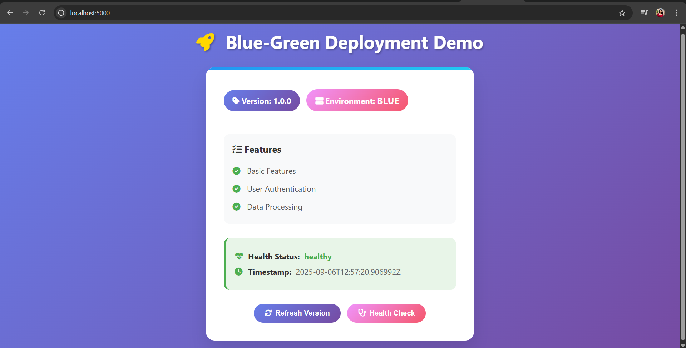
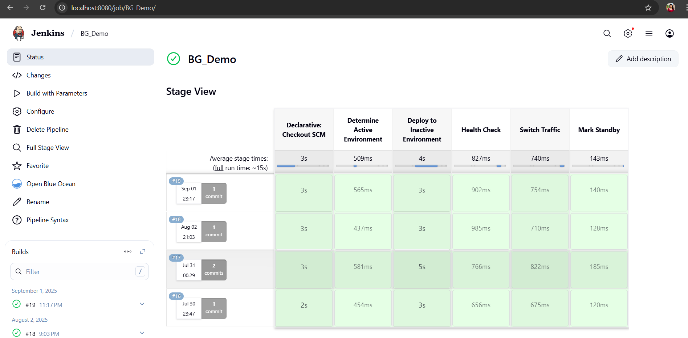

# Blue-Green Deployment Demo

### Blue Environment (Port 5000)



🚀 **A comprehensive Blue-Green Deployment simulation powered by Jenkins CI/CD pipeline.
This project demonstrates how to achieve zero-downtime deployments, safe rollbacks, and continuous delivery using modern DevOps practices.**

## 📋 Table of Contents
- [Overview](#overview)
- [Why Blue-Green Deployment?](#why-blue-green-deployment)
- [Architecture](#architecture)
- [Prerequisites](#prerequisites)
- [Setup Instructions](#setup-instructions)
- [Usage Guide](#usage-guide)
- [Screenshots](#screenshots)
- [Traffic Switching](#traffic-switching)
- [Rollback Strategy](#rollback-strategy)
- [Project Structure](#project-structure)
- [Contributing](#contributing)

## 🎯 Overview

This project implements the Blue-Green Deployment strategy using a CI/CD pipeline with Jenkins.
The system maintains two identical production environments (Blue and Green). At any given time, one environment is live while the other is idle (standby). Deployments happen on the standby environment, and once verified, traffic is switched seamlessly.

### Key Features
- ✅ Zero-downtime deployments
- ✅ Instant rollback capability
- ✅ Automated health checks
- ✅ Traffic switching simulation
- ✅ Jenkins pipeline automation
- ✅ Real-time environment monitoring

## 🔍 Why Blue-Green Deployment?

Blue-Green deployment is crucial for modern applications because it provides:

1. **Zero Downtime**: Users experience no service interruption during deployments
2. **Risk Mitigation**: New versions are tested in production-like environments before receiving traffic
3. **Instant Rollback**: Quick reversion to previous version if issues are detected
4. **Reduced Deployment Risk**: Issues are caught before affecting users
5. **Better Testing**: Production environment testing without impacting live users

## 🏗️ Architecture

```
┌─────────────────┐    ┌─────────────────┐
│   Blue Env      │    │   Green Env     │
│   Port: 5000    │    │   Port: 5001    │
│   Version: 1.0  │    │   Version: 2.0  │
└─────────────────┘    └─────────────────┘
         │                       │
         └───────┐       ┌───────┘
                 │       │
         ┌───────▼───────▼───────┐
         │  Traffic Controller   │
         │     Port: 8000       │
         │    (Admin Panel)     │
         └─────────────────────┘
```
# Blue Environment → Stable environment running version 1.0

# Green Environment → Deployment target for version 2.0

# Traffic Controller → Admin panel for switching traffic between Blue and Green

## 📋 Prerequisites

- **Jenkins** (Latest LTS version)
- **Python** 3.x
- **Git**
- **PowerShell** (for traffic switching tests on windows)
- **Web Browser** (to access the environments and controller)

## 🛠️ Setup Instructions

### 1. Clone the Repository
```bash
git clone <repository-url>
cd blue-green-demo
```

### 2. Install Dependencies
```bash
pip install -r requirements.txt
```

### 3. Configure Environments

The project automatically sets up two environments:
- **Blue Environment**: `localhost:5000`
- **Green Environment**: `localhost:5001`
- **Traffic Controller**: `localhost:8000/admin`

### 4. Setup Jenkins Pipeline

1. Create a new Jenkins job
2. Configure the pipeline using the provided `Jenkinsfile`
3. The pipeline includes the following stages:
   - **Declarative Checkout SCM**
   - **Determine Active Environment**
   - **Deploy to Inactive Environment**
   - **Health Check**
   - **Switch Traffic**
   - **Mark Standby**

## 📖 Usage Guide

### Starting the Application

1. **Run the deployment script**:
   ```bash
   python deploy.py
   ```

2. **Access the environments**:
   - Blue Environment: http://localhost:5000
   - Green Environment: http://localhost:5001
   - Admin Controller: http://localhost:8000/admin

### Jenkins Pipeline Execution
   
The pipeline automatically:
1. Detects the currently active environment
2. Deploys new version to inactive environment
3. Runs health checks
4. Switches traffic if deployment is successful
5. Marks the old environment as standby

## 📸 Screenshots

### Blue Environment (Port 5000)

*Blue environment showing Version 1.0 with basic features*

### Green Environment (Port 5001)

*Green environment showing Version 2.0 with advanced features including Analytics, Notifications, and API Gateway*

### Traffic Controller - Blue Active

*Admin panel showing Blue environment as active with traffic routing*

### Jenkins Pipeline Stage View

*Jenkins pipeline execution showing all stages with timing metrics*

### Traffic Controller - Green Active

*Admin panel showing Green environment as active after successful deployment*


### Traffic Switching Test (PowerShell)

*PowerShell commands demonstrating traffic switching verification*

## 🔄 Traffic Switching

The traffic switching mechanism uses a simple flag-based system:

### Manual Traffic Switch
```bash
# Check current active environment
Get-Content traffic_flag.txt

# Switch traffic manually
python switch_traffic.py
```

### Automated Switch via Jenkins
The Jenkins pipeline automatically switches traffic after successful deployment and health checks.

### Verification Commands
```powershell
# PowerShell commands to verify traffic switching
PS C:\Users\USER> Get-Content C:\Users\USER\Documents\blue-green-demo\traffic_controller\traffic_flag.txt
```

## 🔙 Rollback Strategy

### Automatic Rollback
- Triggered when health checks fail
- Reverts traffic to previous stable environment
- Maintains system availability

### Manual Rollback
```bash
# Emergency rollback
python rollback.py

# Or via Jenkins
# Trigger "Rollback" job in Jenkins
```

## 📁 Project Structure

```
blue-green-demo/
├── app/
│   ├── static/
│   │   └── style.css
│   └── templates/
│       └── index.html
├── blue_environment/
├── green_environment/
├── scripts/
│   ├── deploy.py
│   ├── health_check.py
│   └── switch_traffic.py
├── traffic_controller/
│   ├── controller.py
│   └── traffic_flag.txt
├── screenshots/
├── app.py
├── config.json
├── green_config.json
├── Jenkinsfile
├── requirements.txt
└── README.md
```

## 🔧 Configuration Files

### config.json (Blue Environment)
```json
{
  "version": "1.0.0",
  "environment": "BLUE",
  "port": 5000,
  "features": {
    "basic_features": true,
    "user_authentication": true,
    "data_processing": true
  }
}
```

### green_config.json (Green Environment)
```json
{
  "version": "2.0.0",
  "environment": "GREEN",
  "port": 5001,
  "features": {
    "basic_features": true,
    "user_authentication": true,
    "data_processing": true,
    "advanced_analytics": true,
    "real_time_notifications": true,
    "api_gateway": true
  }
}
```

## 🎯 Key Benefits Demonstrated

1. **Zero Downtime**: Seamless switching between environments
2. **Version Control**: Clear version tracking (1.0 → 2.0)
3. **Feature Rollout**: Progressive feature introduction
4. **Health Monitoring**: Continuous environment health checks
5. **Automated Pipeline**: Full CI/CD automation with Jenkins

## 🤝 Contributing

1. Fork the repository
2. Create a feature branch (`git checkout -b feature/amazing-feature`)
3. Commit your changes (`git commit -m 'Add some amazing feature'`)
4. Push to the branch (`git push origin feature/amazing-feature`)
5. Open a Pull Request

---

**Happy Deploying with Zero Downtime! 🚀**
